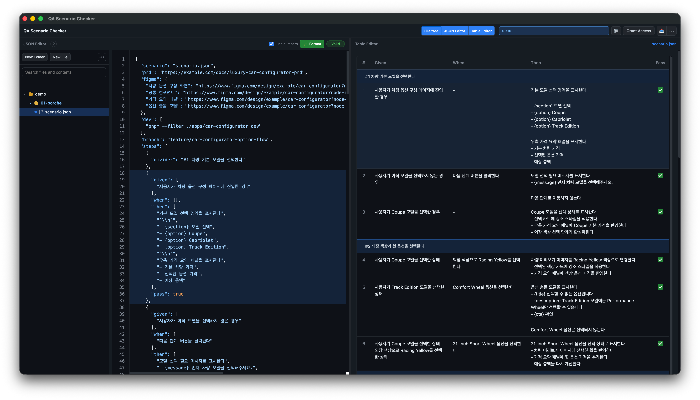

# QA Scenario Checker

[한국어](README.md)

QA Scenario Checker is a Chrome extension for editing QA scenario JSON and reviewing it as a Given/When/Then checklist.



- [Features](#features)
- [Installation](#installation)
- [Usage](#usage)
  - [Write a Scenario](#write-a-scenario)
- [Motivation](#motivation)
- [Browser Compatibility](#browser-compatibility)

## Features

- Edit scenarios with a side-by-side JSON Editor and Table Editor
- Render `given`, `when`, `then`, and `pass` fields as a checklist table
- Support divider rows and divider colors
- Create, rename, copy, delete, and search files and folders in the file tree
- Import a folder or a single JSON file
- Autosave to localStorage with file/folder-oriented workflows
- Validate and format JSON with line numbers and error positions
- Find/replace, undo/redo, and cursor history in the editor
- Export all fields or a selected set of fields

## Installation

1. Open `chrome://extensions` in Chrome.
2. Enable `Developer mode`.
3. Click `Load unpacked`.
4. Select this repository folder.
5. Open QA Scenario Checker from the extension toolbar icon.

## Usage

### Write a Scenario

- When you write content in the Table Editor on the right, the JSON Editor on the left updates automatically.
- When you write scenario JSON in the JSON Editor on the left, the Table Editor on the right updates automatically.

> [!TIP]
>
> How to use this in the three-step development process of [Specification]-[Implementation]-[Verification]
>
> You can build a development process where you write the [Specification] easily in the Table Editor, inject the generated JSON file into the LLM context to guide a more accurate [Implementation], and then use the Table Editor for [Verification].

```json
{
  "scenario": "Login flow",
  "steps": [
    {
      "given": ["User is on the login page"],
      "when": ["User enters valid credentials"],
      "then": ["Dashboard is displayed"],
      "pass": false
    },
    {
      "divider": "Error cases"
    },
    {
      "given": ["User is on the login page"],
      "when": ["User enters a wrong password"],
      "then": ["An error message is displayed"],
      "pass": false
    }
  ]
}
```

## Motivation

situations:

- As AI advanced, [Implementation] in the three-step development process of [Specification]-[Implementation]-[Verification] became easier to replace with AI, which made [Specification] and [Verification] even more important.
- I had already been using an ATDD-style workflow by writing QA scenarios in a Given/When/Then structure in Google Sheets, with [Specification] and [Verification] in mind. However, Google Sheets was not a suitable data structure to pass as context to AI, so it created a high prompt input cost.
- I chose JSON because it is a much better data structure for LLMs to understand, while also recognizing that a sheet-style UI is better for humans to write requirements and verify behavior.

actions:

- To keep using ATDD together with AI, I built the QA Scenario Checker Chrome extension so QA scenarios can be managed as JSON while still being written and verified through a sheet-style UI.
- With QA Scenario Checker, I established a development process where [Specification] can be written easily, the resulting JSON file can be injected into AI context to guide a more accurate [Implementation], and the implemented behavior can be [Verified].

## Browser Compatibility

The primary target is Chrome as an unpacked extension. Folder opening and write permissions depend on the browser's File System Access API support.
